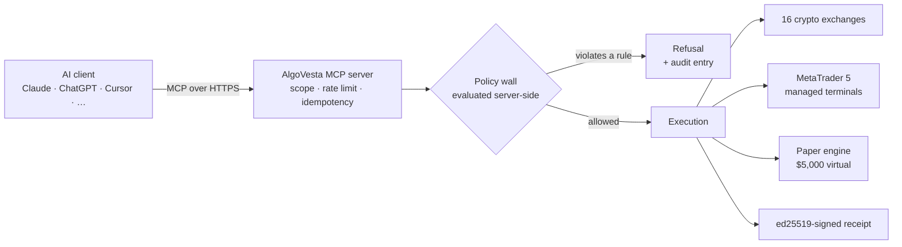

<div align="center">

# AlgoVesta MCP Server

**Trade 16 crypto exchanges and MetaTrader 5 from your AI assistant — over one MCP connection.**

[](https://registry.modelcontextprotocol.io)
[](https://modelcontextprotocol.io)
[](docs/AUTHENTICATION.md)
[](docs/TOOLS.md)
[](LICENSE)

[Documentation](https://algovesta.com/mcp-docs.html) · [Tool reference](docs/TOOLS.md) · [Safety model](docs/SAFETY.md) · [Tool schemas (JSON)](https://algovesta.com/mcp/tools.json) · [Product overview](https://algovesta.com/features-mcp.html)

</div>

---

AlgoVesta runs a hosted [Model Context Protocol](https://modelcontextprotocol.io) server that reaches **16 crypto exchanges and MetaTrader 5** through a single HTTPS endpoint. Claude, ChatGPT, Cursor, Claude Code, Gemini CLI or any other MCP-capable client can read balances, open and close positions, move stop-loss and take-profit, and audit its own actions.

Your risk rules are compiled to JSON and evaluated **on the server, after the request leaves the model** — outside the reach of anything the model can be persuaded to say. Every new key starts on a **$5,000 paper balance**, and every action returns an **ed25519-signed, hash-chained receipt**.

> **Hosted and closed-source.** This repository is the public documentation, tool reference and client configuration set. There is nothing to install, build or self-host — you connect to the hosted endpoint.

**Contents** — [At a glance](#at-a-glance) · [How it works](#how-it-works) · [Quick start](#quick-start) · [Connect your client](#connect-your-client) · [Supported AI clients](#supported-ai-clients) · [In use](#what-it-looks-like-in-use) · [Tools](#tools) · [Safety model](#safety-model) · [Venues](#venues) · [Performance and limits](#performance-and-limits) · [Endpoints](#endpoints) · [FAQ](#faq)

## At a glance

| | |
|---|---|
| **Transport** | Remote MCP over Streamable HTTP |
| **Authentication** | Secret link, or OAuth 2.1 with mandatory PKCE (`S256`) and Dynamic Client Registration (RFC 7591) |
| **Tools** | 20 — 13 read-only, 3 write, 4 destructive ([reference](docs/TOOLS.md)) |
| **Venues** | 16 crypto exchanges · MetaTrader 5 · built-in paper engine |
| **Default scope** | `paper` — $5,000 virtual balance, identical toolset |
| **Live scope** | Issued only after a second factor, enforced server-side |
| **Risk policy** | Compiled to JSON, evaluated deterministically on the server |
| **Audit** | ed25519-signed, hash-chained receipt per action, independently verifiable |
| **Install** | None. Hosted endpoint. |
| **Registry** | [`com.algovesta/trading`](https://registry.modelcontextprotocol.io) — [server.json](server.json) is that manifest |

## How it works



The model is the **caller**, never the authority. It decides what to ask for; the server decides what happens. Your exchange API keys never leave AlgoVesta and are created without withdrawal permission — the assistant only ever holds a scoped, revocable MCP link.

## Quick start

1. Create an AlgoVesta account and open the **MCP Connection** tab in the panel.
2. Generate a key. New keys default to the `paper` scope; the full link is shown once.
3. Paste the link into your AI client as a custom MCP server.

```
https://api.algovesta.com/u/avmcp_<your-key>/mcp
```

> **That URL is a credential.** Treat it like a password. If it leaks, revoke it in the panel — revocation takes effect immediately for new connections and drops open event streams within seconds.

Clients that prefer a full authorization flow can use **OAuth 2.1** instead, at `https://api.algovesta.com/mcp`. PKCE (`S256`) is mandatory and Dynamic Client Registration is supported, so most clients configure themselves. See [docs/AUTHENTICATION.md](docs/AUTHENTICATION.md).

## Connect your client

<table>
<tr><td width="50%" valign="top">

**Claude** — web, desktop, iOS, Android

Settings → Connectors → *Add custom connector*, paste the URL, then allow the tools when Claude asks.

[Walkthrough →](examples/claude.md)

</td><td width="50%" valign="top">

**Claude Code**

```bash
claude mcp add --transport http algovesta \
  https://api.algovesta.com/u/avmcp_<your-key>/mcp
```

[Walkthrough →](examples/claude-code.md)

</td></tr>
<tr><td valign="top">

**ChatGPT**

Settings → Connectors → *Advanced* → Developer mode → *Create*, transport **Streamable HTTP**. Custom connectors are a paid-plan feature on OpenAI's side.

[Walkthrough →](examples/chatgpt.md)

</td><td valign="top">

**Cursor** — `~/.cursor/mcp.json`

```json
{ "mcpServers": { "algovesta": {
  "url": "https://api.algovesta.com/u/avmcp_<your-key>/mcp"
} } }
```

</td></tr>
<tr><td valign="top">

**VS Code (GitHub Copilot)** — `.vscode/mcp.json`

```json
{ "servers": { "algovesta": {
  "type": "http",
  "url": "https://api.algovesta.com/u/avmcp_<your-key>/mcp"
} } }
```

</td><td valign="top">

**Gemini CLI** — `~/.gemini/settings.json`

```json
{ "mcpServers": { "algovesta": {
  "httpUrl": "https://api.algovesta.com/u/avmcp_<your-key>/mcp"
} } }
```

</td></tr>
</table>

Ready-made files: [examples/](examples/) · Anything else: [examples/other-clients.md](examples/other-clients.md)

## Supported AI clients

This is a standard remote MCP server over Streamable HTTP, so anything that speaks remote MCP can connect. The clients below document that support themselves — each row links to the client's own configuration docs, which is where the exact field name lives.

<details>
<summary><b>Assistants and chat apps</b> — 8</summary>

| Client | MCP documentation |
|---|---|
| Claude — web, desktop, iOS, Android | [Custom connectors](https://support.claude.com/en/articles/11175166-about-custom-connectors-remote-mcp-servers) |
| ChatGPT — Developer mode connectors | [OpenAI MCP docs](https://platform.openai.com/docs/mcp) |
| Microsoft Copilot Studio agents | [Extend with MCP](https://learn.microsoft.com/en-us/microsoft-copilot-studio/agent-extend-action-mcp) |
| Goose (Block) | [block.github.io/goose](https://block.github.io/goose/) |
| LibreChat | [MCP in LibreChat](https://www.librechat.ai/docs/features/mcp) |
| Open WebUI | [docs.openwebui.com](https://docs.openwebui.com/) |
| Cherry Studio | [docs.cherry-ai.com](https://docs.cherry-ai.com/) |
| Raycast | [raycast.com](https://www.raycast.com/) |

</details>

<details>
<summary><b>Coding agents and IDEs</b> — 19</summary>

| Client | MCP documentation |
|---|---|
| Claude Code | [Claude Code MCP](https://docs.anthropic.com/en/docs/claude-code/mcp) |
| OpenAI Codex CLI | [Codex MCP](https://developers.openai.com/codex/mcp/) |
| Gemini CLI | [MCP servers in Gemini CLI](https://google-gemini.github.io/gemini-cli/docs/tools/mcp-server.html) |
| Cursor | [Cursor MCP](https://cursor.com/docs/context/mcp) |
| VS Code — GitHub Copilot | [MCP servers in VS Code](https://code.visualstudio.com/docs/copilot/customization/mcp-servers) |
| Windsurf | [Cascade MCP](https://docs.windsurf.com/windsurf/cascade/mcp) |
| Zed | [Zed MCP](https://zed.dev/docs/ai/mcp) |
| Cline | [Connecting to a remote server](https://docs.cline.bot/mcp/connecting-to-a-remote-server) |
| Roo Code | [Using MCP in Roo](https://docs.roocode.com/features/mcp/using-mcp-in-roo) |
| Kilo Code | [Using MCP in Kilo Code](https://kilocode.ai/docs/features/mcp/using-mcp-in-kilo-code) |
| Continue | [MCP deep dive](https://docs.continue.dev/customize/deep-dives/mcp) |
| JetBrains AI Assistant | [MCP in JetBrains IDEs](https://www.jetbrains.com/help/ai-assistant/mcp.html) |
| Warp | [Warp MCP](https://docs.warp.dev/knowledge-and-collaboration/mcp) |
| Amazon Q Developer | [MCP with Amazon Q](https://docs.aws.amazon.com/amazonq/latest/qdeveloper-ug/qdev-mcp.html) |
| Kiro (AWS) | [Kiro MCP](https://kiro.dev/docs/mcp/) |
| Sourcegraph Amp | [Amp manual](https://ampcode.com/manual#mcp) |
| Trae | [Trae MCP](https://docs.trae.ai/ide/model-context-protocol) |
| PostHog Code | [posthog.com/code](https://posthog.com/code/) |
| Archestra.AI | [archestra.ai](https://www.archestra.ai/) |

</details>

<details>
<summary><b>Frameworks, automation and developer tools</b> — 6</summary>

| Client | MCP documentation |
|---|---|
| OpenAI Agents SDK | [MCP in the Agents SDK](https://openai.github.io/openai-agents-python/mcp/) |
| fast-agent | [evalstate/fast-agent](https://github.com/evalstate/fast-agent) |
| n8n — MCP Client Tool node | [docs.n8n.io](https://docs.n8n.io/) |
| Postman | [MCP requests](https://learning.postman.com/docs/postman-ai-agent-builder/mcp-requests/overview/) |
| MCP Inspector | [modelcontextprotocol/inspector](https://github.com/modelcontextprotocol/inspector) |
| MCPJam | [mcpjam.com](https://www.mcpjam.com/) |

</details>

> **Scope of that claim.** We have verified **Claude** end to end against this server. The others are listed because they document remote MCP support — not because we individually tested each one. Client support also moves fast, and a given client may gate connectors behind a paid plan (ChatGPT does) or behind its CLI only (the Gemini web app does not accept custom MCP servers). If a listed client misbehaves with us, or one is missing, [open an issue](../../issues).

## What it looks like in use

You never call a tool by name. You ask in plain language; the assistant picks the tool.

| You say | The assistant reaches for |
|---|---|
| *"What's in my accounts right now, and how has this month gone?"* | `get_portfolio_context` — every exchange, MT5 account and the paper book in one call — then `get_trade_history` |
| *"Where is BTC trading on the exchanges I've connected?"* | `compare_venues` — measured price and, where published, bid/ask spread |
| *"If I opened 0.05 BTC long on Binance with a 2% stop, what would it cost and would my rules allow it?"* | `simulate_order` — a dry run **including the policy verdict** |
| *"OK, open it — stop 2% below, target 4% above."* | `place_order` |
| *"Move the stop on my ETH position up to break-even."* | `modify_position` |
| *"Close half of the SOL long."* | `close_position` — partial on crypto, full close on MT5 |
| *"Never risk more than 1% per trade, max 3 positions, stop me after a 5% daily drawdown."* | `compile_policy` — returns readable JSON you approve |
| *"Show me the receipt for that last order and verify it."* | `verify_receipt` — signature and hash chain, against a [public key](https://api.algovesta.com/mcp/receipts/pubkey) you can fetch yourself |
| *"Run my last 90 days of signals again with a 1% risk cap."* | `simulate_policy`, then `get_job_status` |

**And what it will refuse.** *"Turn on auto-trading for that strategy"* — refused; `auto_trade` is not a writable field in any scope. *"Trade on Kraken for me"* when Kraken is not connected — `VENUE_NOT_CONNECTED`, not a guess. *"Open it without a stop"* — refused, with no saved default to fall back on.

On a `paper` key every one of those runs against the $5,000 virtual balance with the identical toolset, so the whole workflow can be rehearsed before real money is reachable.

## Tools

20 tools. Scope `read` works on any key; `paper` / `live` gates the rest.

<details open>
<summary><b>Full tool list</b></summary>

| Tool | Scope | Kind | Purpose |
|---|---|---|---|
| `get_portfolio_context` | read | read-only | Every connected account in one call |
| `get_market_price` | read | read-only | Live price with freshness reported |
| `get_trade_history` | read | read-only | Closed trades and performance across crypto, MT5 and paper |
| `compare_venues` | read | read-only | Ranks your connected exchanges on measured price and spread |
| `simulate_order` | read | read-only | Dry-run including the policy verdict |
| `place_order` | paper / live | destructive | Opens a position (live crypto: market orders only) |
| `compile_policy` | read | read-only | Turns plain-language rules into a policy preview |
| `list_open_orders` | read | read-only | Pending limit orders (paper book) |
| `cancel_order` | paper / live | destructive | Cancels a pending order |
| `close_position` | paper / live | destructive | Closes fully or partially (MT5: full close only) |
| `modify_position` | paper / live | write | Moves stop-loss and take-profit |
| `list_strategies` | read | read-only | Your TradingView strategies and whether real money is on |
| `create_strategy` | paper / live | write | New strategy, always created with real money OFF |
| `update_strategy` | paper / live | write | Changes strategy settings (never `auto_trade`) |
| `verify_receipt` | read | read-only | Checks signature and hash chain |
| `replay_channel` | read | read-only | Backtests a Telegram channel against your rules |
| `backtest_my_signals` | read | read-only | Replays your own past signals with different settings (queued job) |
| `simulate_policy` | read | read-only | Applies a risk policy to the trades you actually closed (queued job) |
| `import_tradingview_backtest` | read | read-only | Recomputes a TradingView trade export with real fees and slippage (queued job) |
| `get_job_status` | read | read-only | Progress and result of a queued job |

</details>

Two of them deserve a note, because what they **refuse** to do is the point:

- **`compare_venues` does not route your order.** It reports the live price and, on venues that publish one, the bid/ask spread. It does not know your fee tier, the order book depth or the slippage you would pay — and it says so in every response. A venue that publishes no bid/ask is listed separately rather than ranked as if its spread were zero. You still name the exchange yourself in `place_order`.
- **`create_strategy` / `update_strategy` cannot turn real money on.** A new strategy is always created with `auto_trade` off, and `auto_trade` is not in the writable field set — an assistant cannot set it, whatever it is asked or persuaded to do. A single order is one action you can see; a strategy keeps trading after the conversation ends, so arming one stays a human decision made in the panel. `ip_allowlist` is refused for the same reason: it is the second factor that verifies where signals come from.

Full reference with descriptions and JSON Schemas: [docs/TOOLS.md](docs/TOOLS.md) · machine-readable: [tools.json](https://algovesta.com/mcp/tools.json)

## Safety model

The AI is the caller — never the authority. Full model: [docs/SAFETY.md](docs/SAFETY.md).

| Control | What it means |
|---|---|
| **Paper by default** | Every new key starts in `paper` scope on a $5,000 virtual balance. Real money is a separate, deliberate act: the `live` scope is issued only after a second factor (TOTP, or an email code for panel-created keys; over OAuth, TOTP is required), enforced server-side with no exceptions. |
| **Server-side policy wall** | Max risk per trade, order-size cap, daily-loss cap, position count, leverage cap, venue/symbol/side restrictions — compiled to JSON and evaluated deterministically after the request leaves the model. A prompt injection can change what the model *sends*; it cannot change how the server evaluates it. |
| **Stop-loss is mandatory** | No stop-loss and no saved default means the order is refused. The stop cannot be removed later either. On forex/MT5, a take-profit is mandatory too. |
| **Idempotency** | Every order-shaped tool — including the read-only `simulate_order`, so one key carries from simulation to placement — requires a client-generated idempotency key. Repeats replay the stored response instead of acting twice. |
| **Signed receipts** | Every action returns an ed25519-signed, hash-chained receipt, verifiable against the [public key endpoint](https://api.algovesta.com/mcp/receipts/pubkey). |
| **Kill switch and per-key revocation** | Freeze everything at once, or revoke one client without touching the others. |
| **Structural tenant isolation** | Tools have no identity parameter at all. The account is derived from the authenticated connection, so there is no argument a confused model or an attacker could supply to reach another account. |
| **No withdrawal path** | Exchange API keys are created without withdrawal permission and stay inside AlgoVesta, AES-256 encrypted. The AI only ever holds a scoped, revocable MCP link. |

## Venues

**Crypto (16)** — Binance · Bybit · OKX · KuCoin · Gate.io · Bitget · Kraken · Coinbase · BingX · Hyperliquid · Backpack · HTX · BloFin · Phemex · WOO X · CoinEx

**Forex, metals, indices** — MetaTrader 5, zero installation: AlgoVesta runs the MT5 terminals on its own managed servers, connected to your broker 24/7.

**Simulation** — built-in paper engine, $5,000 virtual.

Six exchanges — Binance, Bybit, OKX, Gate.io, KuCoin and Bitget — have been verified end to end with real money on both futures and spot, with stop-loss and take-profit confirmed on the exchange itself. Each exchange has its own quirks, and the differences are deliberate rather than gaps: Bybit and Bitget do not accept a second take-profit leg on spot; OKX spot is routed through the raw API to keep a cash account from silently becoming a margin account; Binance spot enforces a minimum notional before buying; KuCoin market buys are placed in cost mode. A venue becomes available to the AI only after you connect it — asking for one you have not connected returns `VENUE_NOT_CONNECTED` rather than a guess.

## Performance and limits

| Limit | Value |
|---|---|
| All tool calls, per key | 60 / minute |
| `place_order` | 10 / minute |
| `replay_channel` | 5 / hour (results cached 24 h) |

Measured, not marketing — all figures measured in August 2026:

| Stage | Measured |
|---|---|
| Request intake and parsing | 17–67 ms (median 38, n=6) |
| End to end on MetaTrader 5 | about 1 second (849 ms on a live demo order) |
| End to end on a crypto exchange | about 3 seconds (2,785 ms on a live order) |
| Paper engine | median 318 ms (n=18, min 284, max 769) |

Time spent inside your AI client — the model thinking, and you confirming — is not included and usually dominates. This server is not a low-latency execution venue and is not sold as one.

## Endpoints

| Purpose | URL |
|---|---|
| MCP — secret link | `https://api.algovesta.com/u/avmcp_<key>/mcp` |
| MCP — OAuth 2.1 | `https://api.algovesta.com/mcp` |
| Live events (SSE) | `https://api.algovesta.com/mcp/events` · `/u/avmcp_<key>/events` |
| OAuth metadata | [`/.well-known/oauth-authorization-server`](https://api.algovesta.com/.well-known/oauth-authorization-server) · [`/.well-known/oauth-protected-resource`](https://api.algovesta.com/.well-known/oauth-protected-resource) |
| Receipt public key | [`/mcp/receipts/pubkey`](https://api.algovesta.com/mcp/receipts/pubkey) |
| Tool schemas | [`https://algovesta.com/mcp/tools.json`](https://algovesta.com/mcp/tools.json) |

Published in the official [MCP Registry](https://registry.modelcontextprotocol.io) as `com.algovesta/trading`; [server.json](server.json) in this repository is that manifest.

## FAQ

<details>
<summary><b>Can Claude, ChatGPT or Cursor actually place a real trade on my exchange account?</b></summary>

Yes — once you give it a key with the `live` scope, and that scope is only issued after a second factor. Until then the same assistant runs against a $5,000 paper balance with identical tools, so you can rehearse the entire workflow before any real money is reachable.

</details>

<details>
<summary><b>Do I have to give my exchange API keys to the AI?</b></summary>

No, and you should never do that with any tool. Your API keys stay inside AlgoVesta, encrypted, created without withdrawal permission. The assistant only ever holds an MCP link — scoped, rate-limited, policy-checked, individually revocable, and useless for moving funds off an exchange.

</details>

<details>
<summary><b>Can a prompt injection make the AI ignore my risk rules?</b></summary>

It can change what the model asks for. It does not change how the server answers: your rules are evaluated after the request leaves the model, by code the prompt never reaches, and a violation is rejected and written to the audit log. The limits of that guarantee are worth stating plainly — it covers rule evaluation, scope and account isolation, not the wording of what the assistant tells you afterwards.

</details>

<details>
<summary><b>What happens if the model calls <code>place_order</code> twice by mistake?</b></summary>

Nothing happens twice. Every write tool requires an idempotency key, and a repeat of the same key returns the stored response instead of acting again.

</details>

<details>
<summary><b>How do I stop everything immediately?</b></summary>

The kill switch in the panel (`POST /api/mcp/freeze`) stops everything at once; every tool then returns `user_frozen`. To cut off a single client, revoke just that key.

</details>

## Support

Account and trading questions: [support](https://algovesta.com/support-ticket.html) · [support@algovesta.com](mailto:support@algovesta.com)
Vulnerability reports: [SECURITY.md](SECURITY.md)
Client that will not connect, or one missing from the list above: [open an issue](../../issues)

## Compliance

AlgoVesta does not generate signals, does not hold, receive or move client funds, and does not provide investment advice. Trading carries risk; automation does not remove it. Every new key starts on paper.

## License

Copyright (c) 2026 AlgoVesta. Documentation and configuration examples in this repository are licensed under [CC BY 4.0](LICENSE). The AlgoVesta MCP server itself is proprietary and hosted; this repository contains no server source code.
